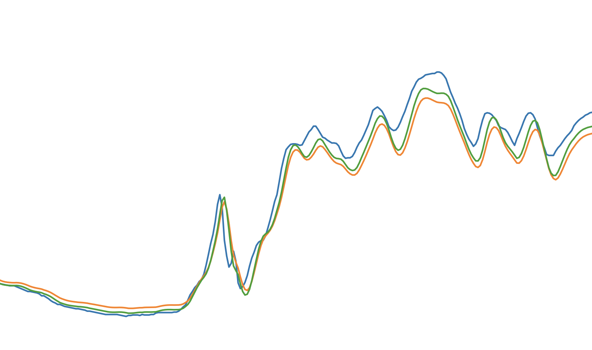

## Mandatory solution requirements

The solution repository should contain (see also the [sample repository](https://github.com/kclosu/no_flood_with_ai) from the organizers):

- **Jupiter Notebook** with step-by-step model construction and comments;

- **A presentation** (in pdf format) describing the proposed forecasting method. The presentation doesn't have to be in slide format;

- **Dockerfile** to run the script, generating a forecast of maximum water levels for the specified period. The period is specified as command line parameters when starting the docker container

  ```docker run -it ... 2020-10-11 2020-10-21```

  The script output would be a similar file where ten strings corresponding to the next ten days contain projected water level values.

  <p align="center">
    
  </p>

## The flood forecast model should meet the following criteria:

- The Nash–Sutcliffe coefficient for each hydro monitoring point > 0.5
- Provide reliable forecasts within a sufficient range (ten days)
- Be acceptably accurate (MAE up to 50)
- Provide an advance forecast of abnormal (above unfavorable or dangerous) levels
- Provide an advance forecast of sharp level changes.

### Example

Let’s have a look at the chart below. The green curve shows the observed water level, the blue curve shows the output of Model _A_, and the orange one, the output of Model _B_. 

<p align="center">
  
</p>


Model _A_ (blue) will be given preference, because it provides a better advance forecast.

## Additional assessment criteria include

- Taking into account the physical bases and dynamics of key streamflow characteristics: meteorological conditions, snow accumulation and melting, evaporation, vertical heat and moisture transfer in non-saturated soil areas, horizontal water flows on watershed slopes, subsurface and ground runoff
- Taking into account key river system phenomena and process patterns: high waters, floods, baseflows – annual streamflow phases. Cycle analysis techniques and taking cyclicity into account
- Taking into account streamflow movement patterns and the particular features of emerging flood wave movement downstream the Amur
- Taking into account side inflows, particularly from the key tributaries of Bureya, Sungari and Ussuri. When tributary floods coincide with the main wave coming down from the Upper Amur, maximum water levels may rise dramatically
- Studying possibilities for use of results of ensemble calculations of global climate models as input data
- Taking into account the spatial irregularity of watershed characteristics (terrain, mountains, plains)
- Using global data bases on terrain, soils and land use
- Possibilities for reproduction of multi-year rows of daily average water levels at different points along the Amur riverbed and its tributaries 
- Human impact on the hydrographic network. Discharge control. Reservoir impact. Assessment of the impact of the Zeya reservoir discharge on the Amur water levels downstream from the Zeya confluence
- Hydrological analogy and geographical interpolation techniques. Using mathematical statistics and the probability theory in hydrological calculations. Statistical probability analysis of hydrological data. Using the pair and multiple linear correlation techniques in hydrological calculations. Corresponding levels technique. Forecasting levels (discharges) on no-influx sections. Lag time and ways to measure it
- Building links between corresponding levels and ways to refine them on variable inclines, instable riverbeds and asynchronous side influx. Corresponding level forecasts on influx sections. Calculating lag time and building riverbed discharge lag time isochron charts. Corresponding discharge (level) link building techniques. Link refining. Level (discharge) movement forecast range on no-influx and influx sections
- Gauging maximum water content in snow and flood-time precipitation in riverbed networks and taking them into account in the forecast model
- Forecasting river streamflow based on building physical and statistical dependencies of discharge on key discharge drivers. Long-term forecasting of spring floods on plain rivers. Physical fundamentals for high-water elements forecasting. Springtime river discharge water balance equation. Discharge formation features in various physical and geographical areas. Gauging maximum water content in snow and flood-time precipitation. Infiltration, surface retaining and evaporation related water losses. Factors of water infiltration into frozen soil. Calculating soil water content at the beginning dates of winter and springtime snow melting in various part of the basin
- Techniques for determining how water gets to basin surface. Estimated rain characteristics. Reduction of maximum intensity of precipitation over time. Techniques for calculating the marginal intensity and layer of rain precipitation
- Calculating intra-year level distribution if observation records are insufficient or non-existent. Determining maximum river water levels if observation records are insufficient or non-existent.